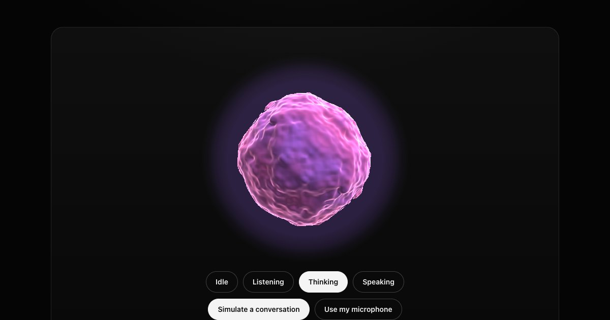

# Orb

A voice agent visualiser. A WebGL sphere that **idles, listens, thinks and
speaks**, each with its own motion and colour, and moves with live audio from
the user's microphone or the agent's voice.

**[→ Live demo](https://yagnikbarasiya23.github.io/orb-voice-visualizer/)**



Zero dependencies. One small fragment shader, no Three.js.

## Run it

You need [Node.js](https://nodejs.org) 20.19 or newer.

```bash
git clone https://github.com/YagnikBarasiya23/orb-voice-visualizer.git
cd orb-voice-visualizer
npm install
npm run dev
```

Open the URL it prints — usually <http://localhost:5173>.

```bash
npm test          # unit tests for audio levels, the spring, blending and colours
npm run build     # → dist/
npm run preview   # serve what you just built
```

## What's in here

| File | What it does |
| --- | --- |
| `orb.js` | The component: the shader, audio analysers, state blending and the render loop |
| `orb.css` | Canvas sizing and the no-WebGL fallback |
| `index.html`, `style.css`, `app.js` | The demo page |
| `test/orb.test.js` | Tests for loudness, the spring, parameter blending and colour parsing |

Only `orb.js` and `orb.css` are needed in your project.

## Use it

```html
<link rel="stylesheet" href="orb.css">
<div id="orb" style="width: 320px"></div>

<script type="module">
  import Orb from './orb.js';

  const orb = new Orb(document.querySelector('#orb'));

  const mic = await navigator.mediaDevices.getUserMedia({ audio: true });
  orb.listenTo(mic);                                // your voice moves it while listening
  orb.speakFrom(document.querySelector('audio'));   // the agent's voice while speaking

  orb.setState('listening');                        // idle | listening | thinking | speaking
</script>
```

### With a realtime voice API

If your SDK gives you audio levels instead of a stream, feed them in directly:

```js
session.on('audio-level', level => orb.setLevel(level)); // 0–1
session.on('user-speaking', () => orb.setState('listening'));
session.on('agent-thinking', () => orb.setState('thinking'));
session.on('agent-speaking', () => orb.setState('speaking'));
```

`setLevel(null)` hands control back to the analysers.

## API

| Member | What it does |
| --- | --- |
| `new Orb(el, { colors?, state? })` | `colors` is `[a, b]` for every state or `{ listening: [a, b], … }` per state |
| `setState(state)` | Blends to `idle`, `listening`, `thinking` or `speaking` over 400 ms |
| `listenTo(stream)` | A `MediaStream` (the mic) drives the listening motion |
| `speakFrom(source)` | An `<audio>`/`<video>` element or a `MediaStream` drives the speaking motion. Elements stay audible |
| `setLevel(level)` | Manual loudness 0–1; `null` returns to the analysers |
| `setColors(colors)` | Blends to new colours |
| `destroy()` | Stops rendering, releases the WebGL context and closes the audio graph |

The orb is square and fills its element's width. Size it with `width` on the
element.

## How it works

**One triangle, one shader.** The canvas draws a single full-screen triangle.
The fragment shader ray-marches a sphere whose surface is pushed in and out
by four octaves of 3D noise, then lights it with a rim term and a two-colour
band. Outside the sphere it adds a soft halo that fades out before the edge
of the canvas.

**Audio to motion.** An `AnalyserNode` reads the waveform each frame. Its RMS
is scaled into 0–1 and fed through a critically damped spring, so the orb
swells quickly and settles smoothly instead of jittering.

**States blend, they don't snap.** Each state is a set of numbers: flow
speed, depth, halo, how much audio matters, and two colours. Switching state
interpolates all of them over 400 ms, and the noise advances by accumulated
phase, so a speed change never makes the surface jump.

**Cheap when unseen.** Rendering stops when the orb scrolls off-screen or the
tab is hidden, and pixel density is capped at 2×.

**Accessible.** The element is an image labelled with its state ("Assistant
is listening"). Reduced motion slows it to a gentle breath. Without WebGL it
falls back to a CSS gradient blob that still follows the audio.

An `<audio>` element can only be routed through one `AudioContext`. After
`destroy()`, that element plays through the closed context and stays silent,
so give a new orb a new element.

## License

MIT © 2026 Yagnik Barasiya
